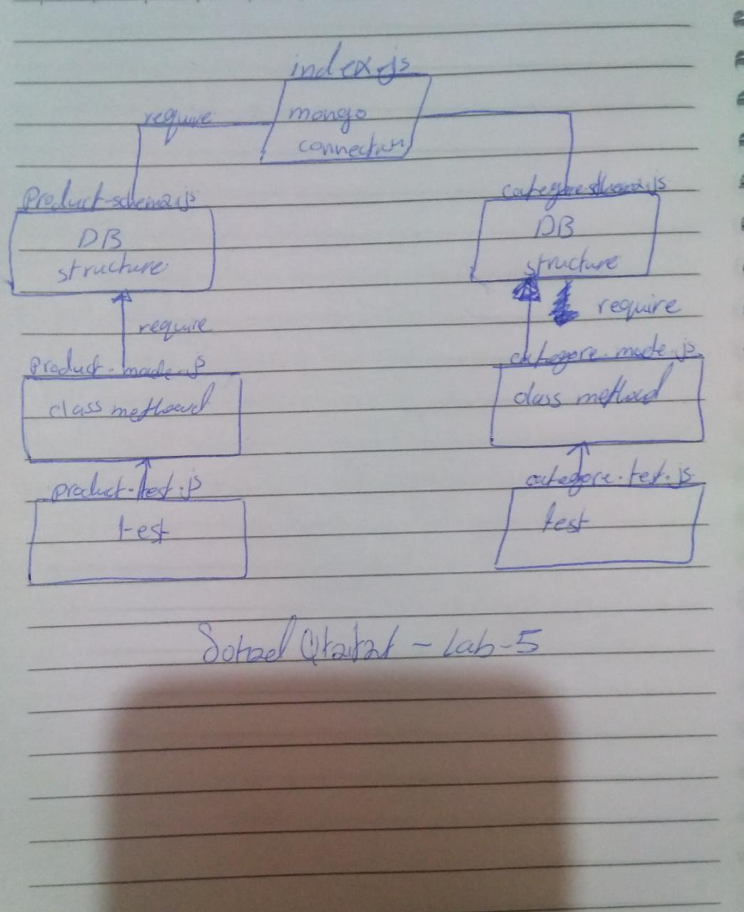

# data-Modeling-With-NoSQL-Databases
LAB: Data Modeling With NoSQL Databases :sparkles: :dizzy: :computer:

### Author: Sohad Qtaitat

### Links and Resources
- [submission PR](https://github.com/401-advanced-javascript-sohad/data-Modeling-With-NoSQL-Databases/pull/1)
- [ci/cd](https://github.com/401-advanced-javascript-sohad/data-Modeling-With-NoSQL-Databases/actions) (GitHub Actions)

### Setup
- install the needed Dependencies JEST ESLINT and use npm run test to run it 

#### `.env` requirements (where applicable)
i.e.
- `PORT` - Port Number
- `MONGODB_URI` - URL to the running mongo instance/db

#### How to initialize/run your application (where applicable)
- `npm run test`

#### Tests
- npm run test 

#### UML
